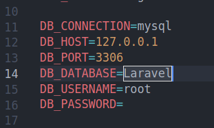

## About the application
A mini blog where you will read about several universities

## install and run

1. Download Zip or Clone.
2. Run the command `composer i`
3. Create env file Run the command `cp .env.example .env`
4.  Enter the name of your database

     
5. Run the command `php artisan migrate` 
6. Run the command `php artisan db:seed`
7. Run the command `php artisan serve`
8. Go to localhost and add `/blog` at the bottom of the url. 
9.  for example: http://localhost:8000/blog
