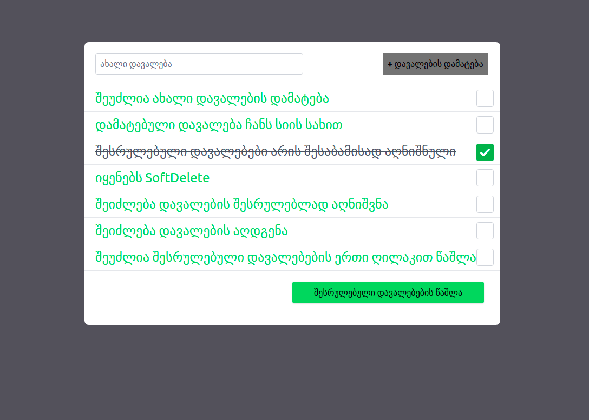

- [About app](#about-app)
- [App looks like](#app-looks-like)
- [Install and Run](#install-and-run)
- [Resource](#resource)

## About app
  To Do App is an app where you can save your daily diary or future plans that you want in the future, it will help you in reminders.
## App looks like

## Install and Run

1. Download Project ZIP or Clone.
2. Run the command `composer i`
3. Run the command `npm i`
4. Run the command `cp .env.example .env`
5. Connect to the base.
6. Run the command `php artisan key:generate`
7. Run the command `npm run dev` or `npm run watch`
8. Run the command `php aritsan serve`
9. Go to `http://localhost:8000/tasks`

## Resource
* [Tailwindcss]('https://tailwindcss.com/')
